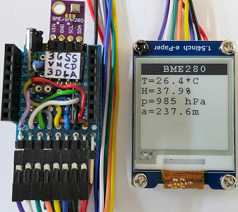

# D1 mini with EPD 1inch54: Display temperature, humidity and pressure measured by a BME280
Sketch: D1_Epd0154bw_BME280.ino, Version 2018-04-15   
[Deutsche Version](./LIESMICH.md "Deutsche Version")   

Measure temperature, humidity, pressure/altitude with a BME280 every 5 seconds and display values on a 2-color e-paper display (1.54 inch, 200x200 px, black and white)

## Hardware
* WeMos D1 Mini
* Waveshare e-paper display (1.54 inch, 200x200 px, black and white).  
* BME280 connected to I2C: SCL=D1,SDA=D2,GND,3V3 (I2C-address 0x76)
* Upon request: protoboard with spi and i2c connection

   

## Example for Serial output

```
 Init e-Paper Display: INIT OK
 Sensor BME280 ready.
 22.9|0.0|633|3798.4
 26.4|38.3|985|237.7
 26.4|38.0|985|238.3
```

