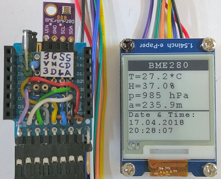

# D1 mini mit EPD 1,54inch: Anzeige von Temperatur, Feuchtigkeit und Druck eines BME280 und MQTT Ver&ouml;ffentlichung
Sketch: D1_Epd0154bw_BME280_mqtt.ino, Version 2018-04-15      
[English Version](./README.md "English Version")   

Messung von Temperatur, Luftfeuchtigkeit, Luftdruck/H&ouml;he mit einem BME280-Sensor alle 5 Sekunden und Anzeige der Werte auf einem 2-Farben e-Paper Display (1,54 inch, 200x200 px, schwarz/wei&szlig;).   
Weiters werden die Werte mit MQTT ver&ouml;ffenlicht:
* Senden der Werte mit dem Topic "BME280_1: "
* Senden des Topics "getDate" und warten auf eine Antwort mit Topic "date", payload `YYYYmmdd HHMMSS` (YYYY Jahr, mm Monat, dd Tag, HH Stunde, MM Minute, SS Sekunden)   

Nach dem Senden geht der D1mini f&uuml;r 10 Minuten in Tiefschlaf.

**Wichtig: Das Beispiel ben&ouml;tigt einen Broker! (zB Mosquitto)**

__*Nicht vergessen: Die WLAN-Daten an das eigene Netzwerk anpassen*__ in der Zeile:   
`MqttClientKH client("..ssid..", "..password..","mqtt server name");`  

## Hardware
* WeMos D1 Mini
* Waveshare e-paper display (1,54 inch, 200x200 px, schwarz-wei&szlig;).
* BME280 am I2C: SCL=D1,SDA=D2,GND,3V3 (I2C-Adresse 0x76)
* Eventuell Protoboard mit Anschl&uuml;ssen f&uuml;r den SPI- und I2C-Bus

  

Init e-Paper Display: INIT OK
Sensor BME280 ready.

## Beispiel f&uuml;r die Ausgabe auf der seriellen Schnittstelle

```
Connecting to Raspi11
.......
Connected! IP address is 192.168.1.174
MQTT: Not connected - reconnect...
=====BME280_1 connected======
-----publish topic list (0)-------
-----subscribe topic list (1)-----
date
==============================
26.9|38.5|985|234.9 published!
 - ePaper Display updated.
27.0|38.4|985|235.4 published!
 - ePaper Display NOT updated.
20180417 202727
27.0|37.4|985|236.1 published!
 - ePaper Display NOT updated.
20180417 202734
27.1|38.8|985|235.8 published!
 - ePaper Display updated.
20180417 202739

```
