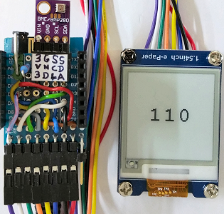

# D1 mini mit EPD 1.54inch: Z&auml;hler
Sketch: D1_Epd0154bw_Counter.ino, Version 2018-05-05      
[English Version](./README.md "English Version")   

E-Paper-Displays (EDP) brauchen (zumindest derzeit) relativ lange, um  angezeigte Inhalte zu erneuern (von ein bis weit &uuml;ber 10 Sekunden bei Farbdisplays).   
Dieses Beispielprogramm enth&auml;lt einen Z&auml;hler und versucht den Z&auml;hlerstand auf einem e-Paper Display anzuzeigen (1,54 inch, 200x200 Pixel, schwarz-wei&szlig;).   
__Im Detail:__   
* Der Z&auml;hler z&auml;hlt in einer Schleife im 0,5-Sekunden-Takt von 1 bis 120.
* Ist das EDP bereit, wird der Z&auml;hlerstand angezeigt und bleibt f&uuml;r 3,34s stabil.
* Jeder Z&auml;hlerstand wird auf der seriellen Schnittstelle angezeigt und die in der Schleife durchgef&uuml;hrte Aktion durch `_SHOW`, `_busy` oder `_wait` beschrieben.

## Hardware
* WeMos D1 Mini
* Waveshare e-paper display (1.54 inch, 200x200 px, schwarz-wei&szlig;).
* Eventuell Protoboard mit Anschl&uuml;ssen f&uuml;r den SPI-Bus

   

## Beispiel f&uuml;r die Ausgabe auf der seriellen Schnittstelle

```
Init e-Paper Display: INIT OK
  1_SHOW    2_busy    3_busy    4_wait    5_wait    6_wait    7_wait    8_SHOW    9_busy   10_busy  
 11_wait   12_wait   13_wait   14_wait   15_SHOW   16_busy   17_busy   18_wait   19_wait   20_wait  
 21_wait   22_SHOW   23_busy   24_busy   25_wait   26_wait   27_wait   28_wait   29_SHOW   30_busy  
 31_busy   32_wait   33_wait   34_wait   35_wait   36_SHOW   37_busy   38_busy  
```

