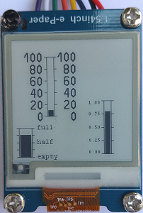

# D1 mini mit EPD 1,54 inch: Balkengrafik
Sketch: D1_Epd0154bw_EpdPainterBar1.ino, Version 2018-06-09      
[English Version](./README.md "English Version")   

Dieses Programm zeigt verschiedene Gr&ouml;&szlig;en und Beschriftungen einer Balkengrafik auf einem e-Paper Display an (1,54 inch, 200x200 Pixel, schwarz-wei&szlig;).   
Die Einstellung der Parameter erfolgt in der Klasse __EpdPainterBar__ mit der Methode `setParams()`    
```
bool setParams(int x0, int y0, int x1, int y1, int xscaleline, int xgapbar, double vmin, double vmax, double vstep);
```
(x0/y0) ........ linke, obere Ecke des Zeichenbereichs (in Pixel)   
(x1/y1) ........ rechte, untere Ecke des Zeichenbereichs (in Pixel)   
xscaleline ... L&auml;nge der Scalenstriche in x-Richtung (in Pixel)   
xgapbar ...... Abstand zwischen der Balkenrahmenrechteck und dem Balken (in Pixel)   
vmin ........... minimaler Wert in der "echten" Welt   
vmax .......... minimaler Wert in der "echten" Welt   
vstep .......... Schrittweite der Skalenstriche zwischen vmin und vmax (als "echter" Wert)   

### Das Zeichnen einer Balkengrafik erfolgt in vier Schritten:
1. Festlegen der Zeichenfl&auml;che und des Wertebereichs in der "realen" Welt mit `setParams()`    
2. Zeichnen des Rahmens inklusive Skalenstrichen mit `drawFrame()`    
3. Zeichnen der Skalenbeschriftung (au&szlig;erhalb des Rahmens) mit `drawScale()`    
4. Zeichnen des Balkens mit `drawBar(value)`    

## Hardware
* WeMos D1 Mini
* Waveshare e-paper display (1,54 inch, 200x200 px, schwarz-wei&szlig;).
* Eventuell Protoboard mit Anschl&uuml;ssen f&uuml;r den SPI-Bus

   
