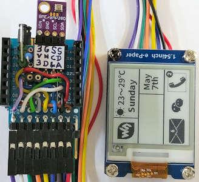

# D1 mini mit EPD 1,54inch: Hintergrundbild aus dem PROGMEM
Sketch: D1_Epd0154bw_Background.ino, Version 2018-04-15      
[English Version](./README.md "English Version")   

Dieses Programm zeichnet ein Hintergrundbild aus dem Programmspeicher auf ein e-Paper Display (1,54 inch, 200x200 Pixel, schwarz-wei&szlig;).

## Hardware
* WeMos D1 Mini
* Waveshare e-paper display (1,54 inch, 200x200 px, schwarz-wei&szlig;).
* Eventuell Protoboard mit Anschl&uuml;ssen f&uuml;r den SPI- und I2C-Bus

   
