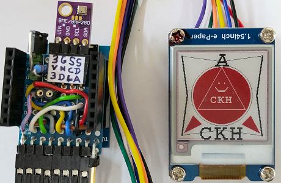

# D1 mini mit EPD 1,54inch: Zeichnen von Figuren und Text (3 f&auml;rbig)
Sketch: D1_Epd0154red_TestAll.ino, Version 2018-04-15      
[English Version](./README.md "English Version")   

Dieses Programm zeichnet Text sowie verschiedene Figuren wie Linien, Dreiecke, Rechtecke und Kreise auf ein 3-Farben e-Paper Display (1,54 inch, 200x200 Pixel, schwarz-wei&szlig;-rot).

## Hardware
* WeMos D1 Mini
* Waveshare e-paper display (1,54 inch, 200x200 px, schwarz-wei&szlig;-rot)
* Eventuell Protoboard mit Anschl&uuml;ssen f&uuml;r den SPI- und I2C-Bus

 
