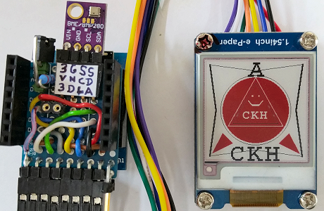

# D1 mini with EPD 1inch54: Draw shapes and text (3 color)
Sketch: D1_Epd0154red_TestAll.ino, Version 2018-04-15   
[Deutsche Version](./LIESMICH.md "Deutsche Version")   

Demo program to display text and shapes like lines, triangles, rectangles and circles on a 3-color e-paper display (1.54 inch, 200x200 px, black, white, red).

## Hardware
* WeMos D1 Mini
* Waveshare e-paper display (1.54 inch, 200x200 px, black, white, red).  
* Upon request: protoboard with spi and i2c connection

     
