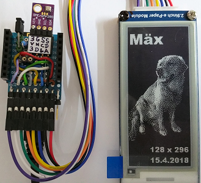

# D1 mini mit EPD 2,9inch: Hintergrundbild aus dem PROGMEM
Sketch: D1_Epd0290bw_Background.ino, Version 2018-04-15      
[English Version](./README.md "English Version")   

Dieses Programm zeichnet ein Hintergundbild aus dem Programmspeicher auf ein e-Paper Display (2,9 inch, 128x296 Pixel, schwarz-wei&szlig;).

## Hardware
* WeMos D1 Mini
* Waveshare e-paper display (2,9 inch, 128x296 px, schwarz-wei&szlig;).
* Eventuell Protoboard mit Anschl&uuml;ssen f&uuml;r den SPI-Bus

   