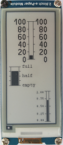

# D1 mini with EPD 2inch9: graphic bar
Sketch: D1_Epd0290bw_EpdPainterBar1.ino, Version 2018-06-09      
[Deutsche Version](./LIESMICH.md "Deutsche Version")   

Demo program to display graphic bars in different sizese on a 2-color epd (e-paper display: 2,9 inch, 128x296 px, black, white).   
The setting of the parameters are performed by the method `setParams()` of class __EpdPainterBar__   
```
bool setParams(int x0, int y0, int x1, int y1, int xscaleline, int xgapbar, double vmin, double vmax, double vstep);
```
(x0/y0) ........ upper left point of drawing area (in pixel)   
(x1/y1) ........ lower right point of drawing area (in pixel)   
xscaleline ... length of scale lines in x-direction (in pixel)   
xgapbar ...... distance between frame line and graphic bar (in pixel)   
vmin ........... minimal value in the "real" world   
vmax .......... maximal value in the "real" world   
vstep .......... spep of scale lines between vmin and vmax ("real" world value)   

### Drawing a bar graph needs four steps:
1. Setting of the parameters for drawing area and "real" world values with `setParams()`    
2. Draw frame with scale lines calling `drawFrame()`    
3. Draw scale values (out of frame) calling `drawScale()`    
4. Draw bar calling `drawBar(value)`    

## Hardware
* WeMos D1 Mini
* Waveshare e-paper display (2,9 inch, 128x296 px, black and white).  
* Upon request: protoboard with spi and i2c connection

   
