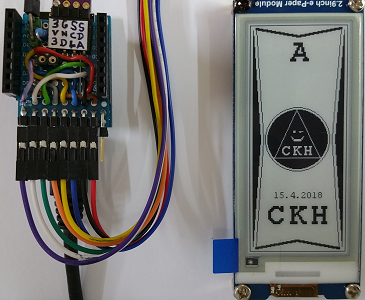

# D1 mini with EPD 2inch9: Draw shapes and text
Sketch: D1_Epd0290bw_TestAll.ino, Version 2018-04-15   
[Deutsche Version](./LIESMICH.md "Deutsche Version")   

Demo program to display text and shapes like lines, triangles, rectangles and circles on a 2-color e-paper display (2,9 inch, 128x296 px, black amd white).

## Hardware
* WeMos D1 Mini
* Waveshare e-paper display (2,9 inch, 128x296 px, black and white).  
* Upon request: protoboard with spi and i2c connection

   

       