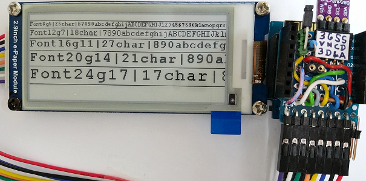
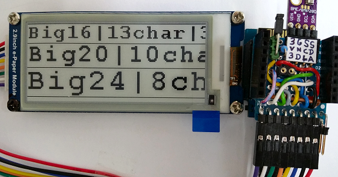

# D1 mini with EPD 2inch9: Draw text with different size (landscape)
Sketch: D1_Epd0290bw_Text90.ino, Version 2018-04-15   
[Deutsche Version](./LIESMICH.md "Deutsche Version")   

Demo program to display text with different size on a 2-color e-paper display: 2,9 inch, 128x296 px, black/white, landscape

## Hardware
* WeMos D1 Mini
* Waveshare e-paper display (2,9 inch, 128x296 px, black and white).  
* Upon request: protoboard with spi and i2c connection

   

   
